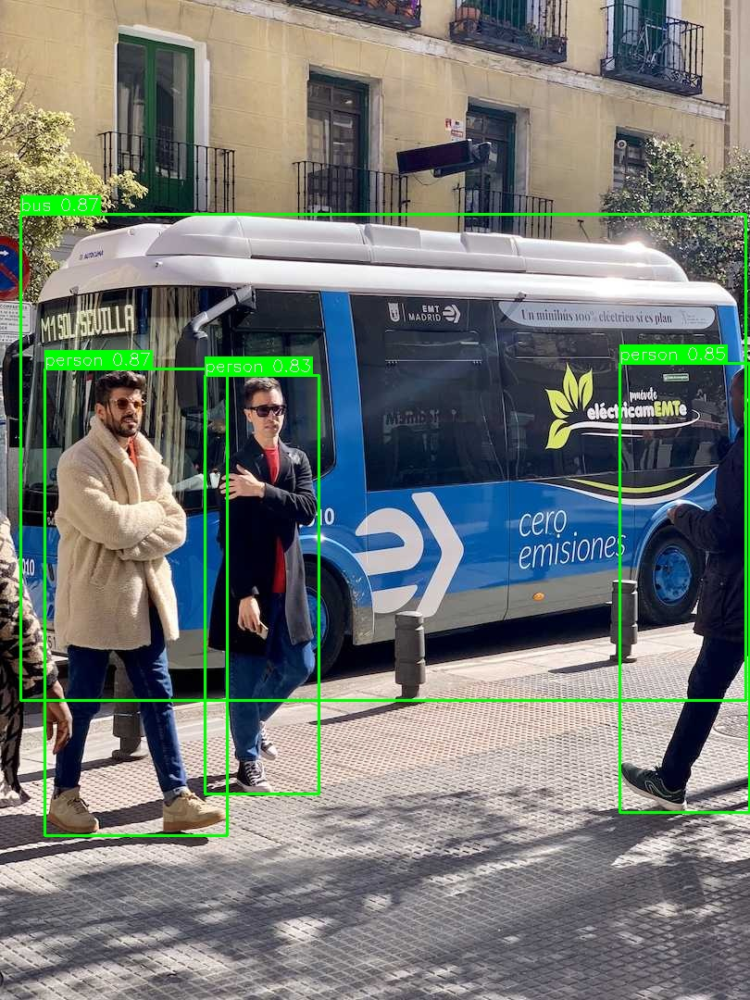

# Assembly-line computer vision

Python scripts for training a YOLO detector and running it on video with OpenCV. My interest in this problem comes from computer vision work at TOFAŞ / Stellantis.

This repository contains the training and inference code. A dataset, trained defect-detection weights and production benchmark logs are not included. The example class names are a starting point for a custom dataset.

## Run

Use Python 3.10 or later, from the repository root:

```bash
python -m venv .venv
source .venv/bin/activate
pip install -r requirements.txt
```

Prepare images and YOLO labels under `data/images/{train,val,test}` and `data/labels/{train,val,test}`. Each label line is `class_id x_center y_center width height`, with coordinates normalized to the image size. Set an absolute dataset root in `data/defects.yaml` and update the class names to match your labels. The configuration is not a NEU dataset conversion.

```bash
python train.py --data data/defects.yaml --model yolov8n.pt --epochs 100
python evaluate.py --data data/defects.yaml --model runs/train/defect_detector/weights/best.pt
python detect.py --source /path/to/video.mp4 --model runs/train/defect_detector/weights/best.pt
python detect.py --source 0 --model /path/to/defect-weights.pt --save annotated.mp4
```

Training may download the base YOLO weights. Those base weights alone do not detect the custom defect classes. Ultralytics may increment a run directory when it already exists; use the checkpoint path printed by training.

## Code

### Public sample



This is an inference and annotation example using **pretrained YOLOv8n COCO weights** and the [public Ultralytics bus sample](https://github.com/ultralytics/ultralytics/blob/main/ultralytics/assets/bus.jpg). It exercises the same `draw_detections` helper as video inference. It does **not** use defect weights, company footage or a production test set.

```bash
python demo.py --model yolov8n.pt
```

The command may download the pretrained weights. Output and actual detection records go to `demo/coco-sample.jpg` and `demo/result.json`. Custom defects still require a labelled dataset and trained checkpoint.

### Files

- `train.py`: fine-tuning and validation through Ultralytics.
- `evaluate.py`: mAP, precision and recall, saved to `eval_results.json`.
- `detect.py`: video/webcam input, annotations, optional MP4 output and an FPS counter. Press `q` to stop the preview; use `--no-display` without a desktop.
- `utils/`: bounding-box drawing, detection logs and augmentation helpers.

The FPS overlay measures the whole loop, including display and logging. It is not a standalone model benchmark. Evaluation results depend on the data split, checkpoint and hardware used.

```bash
python -m unittest discover -s tests -v
```
